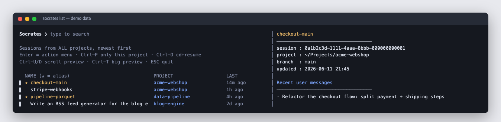
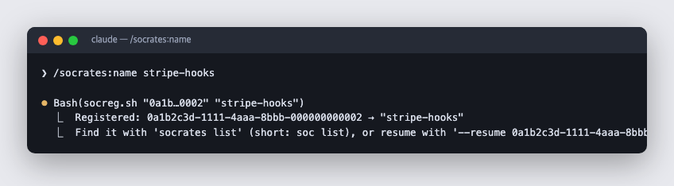
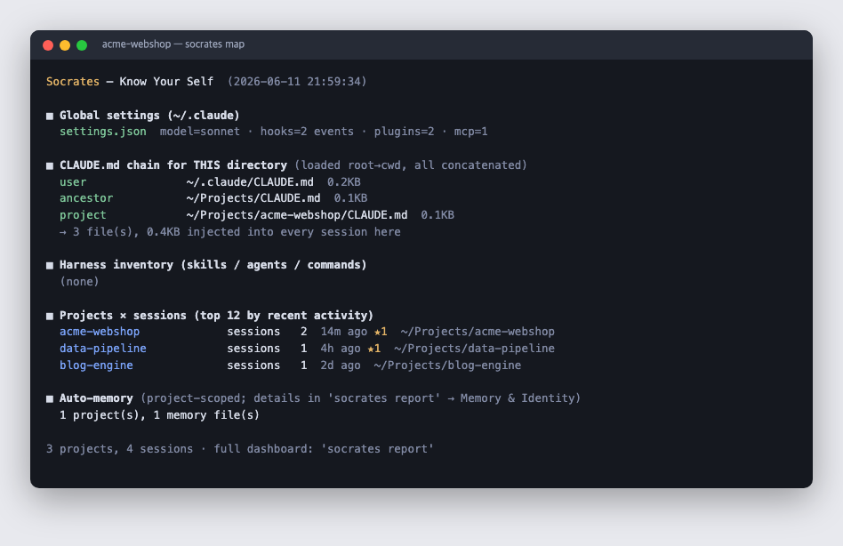
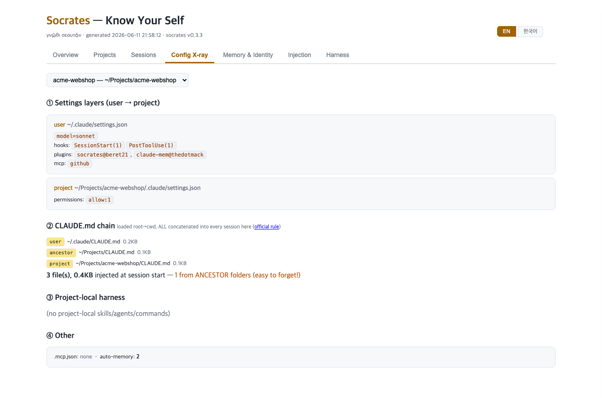
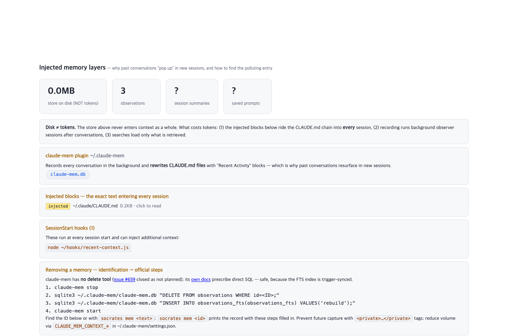

# Socrates — "Know Your Self"

> γνῶθι σεαυτόν — Claude Code 세션·설정 관리 도구

[English](README.md) | **한국어**

여러 Claude Code CLI 세션을 운영하다 보면 두 가지 어려움이 있습니다. 리부팅 후 작업 중이던 세션으로 돌아가기, 그리고 `~/.claude/`와 프로젝트별 `.claude/`에 흩어진 설정(hooks, plugins, MCP, skills, agents)을 한눈에 파악하기. 이 둘을 해결하려고 만든 도구가 Socrates입니다.

> **플랫폼**: 현재 macOS 전용입니다 (`pbcopy`, `open`, BSD `stat`를 사용합니다). Linux/WSL과 Windows 네이티브 지원은 로드맵에 있습니다.


*`socrates list`: 이 기기의 모든 세션을 보여 주며, 별명이 있으면 ★로 표시합니다. Enter를 누르면 액션 메뉴에서 `--resume <UUID>`를 복사할 수 있습니다.*

## 설치

### 방법 A — 플러그인 (권장)

Claude Code 안에서:

```
/plugin marketplace add beret21/socrates
/plugin install socrates@beret21
```

`/socrates` 스킬이 등록되고, SessionStart 훅이 `socrates`/`soc` CLI를 `~/.local/bin`에 자동으로 연결합니다. 다음 세션부터는 일반 터미널에서도 쓸 수 있습니다.

### 방법 B — 수동 설치

```bash
git clone https://github.com/beret21/socrates.git
cd socrates && ./install.sh        # 의존성: brew install fzf jq
```

어느 방법으로 설치하든 `~/.zshrc`는 자동으로 수정하지 않습니다.

## 사용법

### Claude 세션 안에서 — 세션에 별명 붙이기

```
/socrates:name 내-작업-이름    # 현재 세션에 고유 별명 등록
/socrates:status              # 현재 세션 ID·별명 확인
```

별명은 **세션 간에 중복될 수 없습니다**. 같은 폴더에서 동시에 띄운 세션들을 구분하는 것(예: `제안서-본문`, `제안서-hwpx`, `제안서-이미지`)이 이 도구의 목적이기 때문입니다. 다른 세션이 이미 쓰고 있는 이름으로는 등록할 수 없습니다. 오타가 났다면 다시 등록해 덮어쓸 수 있고(이전 별명이 표시됩니다), `socrates unname`으로 별명을 해제할 수도 있습니다.



(수동 설치 시에는 커맨드가 `/socrates-name`, `/socrates-status`입니다.)

### 터미널에서 — 정식 명령 `socrates`, 단축 별칭 `soc`

| 명령 | 동작 |
|------|------|
| `socrates` / `socrates list` | fzf로 세션 목록을 띄웁니다. **Enter를 누르면 액션 메뉴**가 열리고, **Ctrl-Y/Ctrl-O는 복사한 뒤에도 선택기(picker)가 닫히지 않습니다**. 메뉴에서 `--resume` 복사, `cd … && claude --resume …` 전체 복사, UUID만 복사, 별명 부여, 뒤로 가기를 고를 수 있습니다. 단축키: **Ctrl-P 선택한 세션의 프로젝트로 좁히기**, Ctrl-O cd+resume 복사, Ctrl-Y UUID 복사, Ctrl-N 별명 부여, Ctrl-U/D preview 스크롤 |
| `socrates projects` | 프로젝트별 2단계 탐색입니다. 저장 폴더가 곧 그룹 키이며, 세션 수·★ 별명·최근 활동 요약이 바로 표시됩니다. Enter로 해당 프로젝트의 세션 목록에 들어가고, ESC로 돌아옵니다 |
| `socrates find <텍스트>` | **이 기기의 모든 세션을 대상으로 대화 내용을 전문 검색합니다** — 네이티브 picker에는 없는 기능입니다. 검색에 걸린 세션이 같은 picker로 열리고, preview에 매치된 문맥이 하이라이트됩니다 |
| `socrates name [별명]` | 세션을 골라 별명을 부여하거나 수정합니다 |
| `socrates unname` | 별명을 골라 제거합니다 (세션 자체는 그대로 남습니다) |
| `socrates mem <검색어|id>` | claude-mem 플러그인이 나에 대해 기억하는 내용을 읽기 전용으로 검색합니다. id를 넘기면 전체 기록과 **공식 제거 절차**까지 보여 줍니다 (Socrates는 식별과 안내만 하고 직접 지우지는 않습니다) |
| `socrates map` | 설정 계층과 hooks·plugins·MCP·skills/agents 현황을 터미널에 출력합니다 |
| `socrates report` | 탭형 HTML 대시보드를 생성해 엽니다 (Overview / Projects / Sessions / **Config X-ray** / **Anatomy**(주석 달린 셋업 트리 + 실측 지표) / **Memory & Identity** / **Injection** / Harness, **EN/한국어 토글** 지원). Memory & Identity 탭은 Claude가 나를 어떻게 인식하는지(로컬 `~/.claude.json`의 계정 정보)와 모든 프로젝트의 자동 메모리 파일·설명을 보여 줍니다. Config X-ray 탭은 프로젝트별 설정 레이어와 **CLAUDE.md 체인**을 파일 크기, 조상 폴더 경고와 함께 표시합니다. 여기서 CLAUDE.md 체인이란 루트에서 프로젝트까지 내려오며 세션 시작 시 실제로 로드되는 모든 메모리 파일을 말합니다([공식 규칙](https://code.claude.com/docs/en/memory#how-claude-md-files-load)) |
| `socrates update` | 터미널에서 한 줄로 업데이트합니다. 플러그인(스킬+CLI)을 갱신하고 링크를 즉시 전환하므로 claude를 실행할 필요가 없습니다. 수동 설치라면 `git pull`을 수행합니다 |
| `socrates doctor [--fix]` | 환경을 점검합니다: 의존성, PATH, 설치 링크, 레지스트리 무결성, 고아 alias, 버전. `--fix`를 붙이면 끊어졌거나 없는 CLI 링크를 복구합니다 |
| `socrates version` | 설치된 버전을 표시하고 GitHub의 최신 버전을 확인합니다 |


*`socrates map`: 전역 설정, 현재 폴더의 CLAUDE.md 체인, 최근 프로젝트를 한눈에 보여 줍니다.*


*`socrates report` → Config X-ray: 프로젝트별 설정 레이어와 세션이 로드할 모든 CLAUDE.md를 보여 주며, 조상 폴더에서 주입되는 파일을 강조합니다.*


*Injection 탭: 제3자 메모리(claude-mem, 훅)가 세션에 주입하는 내용을 보여 주고, 기억 전체를 둘러볼 수 있습니다.*

**주의:** `claude --resume`은 해당 세션이 속한 프로젝트 폴더에서만 세션을 찾습니다. 먼저 `cd`로 이동한 뒤 실행하세요. picker가 정확한 명령을 알려 주며, Ctrl-O를 누르면 전체 명령이 복사됩니다:

```bash
cd "/path/to/that/project" && claude --resume <UUID> --dangerously-skip-permissions
```

## 구조

```
.claude-plugin/        # plugin.json + marketplace.json (저장소 자체가 마켓플레이스)
bin/socrates           # CLI 진입점 (bin/soc 은 단축 심볼릭 링크)
hooks/hooks.json       # SessionStart: CLI를 ~/.local/bin 에 자동 연결
lib/soc-sessions.sh    # 세션 스캔 + fzf 선택기
lib/soc_report.py      # 설정 분석 + HTML 대시보드 (Python stdlib만)
skills/socrates/       # /socrates 슬래시 커맨드 + alias 레지스트리 스크립트
plan/                  # 설계 문서
```

데이터는 `~/.claude/socrates/sessions.json`(alias 레지스트리)과 `~/.claude/socrates/report.html`(리포트)에 저장됩니다.

## 안전 원칙

- `~/.claude/projects/`의 세션 jsonl은 **읽기 전용**으로만 다루며 절대 수정하지 않습니다
- 쓰기는 `~/.claude/socrates/` 아래에서만 합니다
- `~/.zshrc`를 자동으로 수정하지 않습니다

## Claude Code 네이티브 기능과의 관계

Claude Code에도 자체 세션 도구가 있습니다. Socrates는 이와 경쟁하지 않고 통합하는 쪽을 택했습니다:

- **네이티브 세션 이름**(`claude -n`, `/rename`)은 picker가 읽어서 함께 표시합니다. 이름 우선순위는 ★ Socrates 별명 → 네이티브 이름 → 자동 slug → 첫 메시지 순입니다.
- **세션을 찾아 바로 들어가는 일**은 네이티브 `claude --resume` picker가 이미 잘합니다 (이름/첫 프롬프트 검색, `Ctrl+A`로 전체 프로젝트). 바로 진입할 때는 네이티브를 쓰세요.
- **Socrates는 네이티브에 없는 기능을 더합니다**: 대화 내용 전문 검색(`find`), 전 프로젝트가 기본 범위, 실행 대신 복사(플래그를 직접 조합 가능), 세션을 열지 않는 사후 명명, 설정·하네스를 보여 주는 map과 HTML report, 그리고 `doctor`입니다.

### Desktop ↔ CLI 세션 이동 (실측 검증)

두 프런트엔드가 세션 기록 저장소(`~/.claude/projects/`)를 함께 쓰므로 세션은 둘 사이를 오갈 수 있습니다. 다만 제목과 사이드바 목록은 프런트엔드마다 따로 관리됩니다:

| 방향 | 방법 | 전달 범위 |
|------|------|----------|
| Desktop → CLI | `socrates list`/`find` → 복사 → `cd "<프로젝트>" && claude --resume <UUID>` | 대화 전체 ✓ |
| CLI → Desktop | CLI 세션 안에서 **메시지를 최소 1개 보낸 뒤** `/desktop` | 대화 전체 ✓ — 단, 네이티브 이름(customTitle)은 Desktop 제목에 표시되지 않습니다 |
| CLI 세션을 Desktop 사이드바에 자동 표시 (핸드오프 없이) | 미지원 — Desktop과 CLI는 세션 목록을 따로 관리합니다 | `/desktop`으로 핸드오프하세요 |

## 문제 해결 (Troubleshooting)

**`Plugin "socrates" not found in marketplace "beret21"`** — 이 기기에 마켓플레이스가 아직 등록되지 않았다는 뜻입니다. 설치는 항상 두 단계를 거칩니다. 먼저 `claude plugin marketplace add beret21/socrates`를 실행하고, 그다음 `claude plugin install socrates@beret21`을 실행하세요.

**`Plugin "socrates/beret21" not found`** — 구분자를 혼동한 경우입니다. `/`는 `marketplace add beret21/socrates`처럼 GitHub 좌표(소유자/저장소)에만 쓰고, install/update/uninstall에는 모두 `@`를 씁니다: `socrates@beret21` (플러그인@마켓플레이스). **바깥(GitHub)은 `/`, 안(등록된 카탈로그)은 `@`**라고 기억하면 쉽습니다.

**`brew install fzf`가 `no bottle available`로 실패** — macOS 프리릴리스(베타) 버전에서 발생합니다. Homebrew가 이런 버전을 Tier 2/3으로 분류해 미리 빌드된 바이너리를 제공하지 않기 때문입니다. 대신 fzf 공식 설치 스크립트를 사용하세요 (컴파일 없이 미리 빌드된 바이너리를 내려받습니다):

```bash
git clone --depth 1 https://github.com/junegunn/fzf.git ~/.fzf
~/.fzf/install --bin
ln -sfn ~/.fzf/bin/fzf ~/.local/bin/fzf
```

**`claude -n <이름>`이 아무 효과가 없거나 `/desktop`이 "transcript not found"를 낼 때** — Claude Code는 세션에 **첫 실제 메시지**가 들어온 뒤에야 transcript 파일을 만듭니다. 아무 메시지 없이 종료하거나 메시지를 보내기 전에 `/desktop`을 입력하면 기록 자체가 없어서, 이름을 붙일 대상도 Desktop이 열 대상도 없습니다. 메시지를 하나 보낸 뒤 다시 시도하세요.

**플러그인 설치 직후 `socrates: command not found`** — CLI 링크는 SessionStart 훅이 만들기 때문입니다. Claude 세션을 한 번 시작하거나, Claude 없이 아래 명령으로 직접 만들 수 있습니다:

```bash
bash ~/.claude/plugins/cache/beret21/socrates/*/bin/socrates doctor --fix
```


## Claude Code 네이티브 vs Socrates — 기능별 비교

Claude Code 자체에도 세션 기능이 계속 추가되고 있습니다. 이 표는 "이미 있는 기능인 줄 모르고 만들었다"는 오해를 막기 위한 것이며, 네이티브가 따라잡은 기능은 받아들이고 우리만의 기능은 더 다듬는 기준이 됩니다. **최종 검증: 2026-06-12, Claude Code v2.1.173** 및 공식 문서([sessions](https://code.claude.com/docs/en/sessions), [memory](https://code.claude.com/docs/en/memory), [plugins](https://code.claude.com/docs/en/plugins)) 기준이며, 분기마다 다시 조사합니다. 낡은 내용을 발견하면 이슈로 알려주세요.

| 능력 | Claude Code (네이티브) | Socrates |
|------|----------------------|----------|
| 세션 이름 붙이기 | `claude -n`, `/rename`, picker의 `Ctrl+R` — 시작 시점이거나 세션을 연 상태에서만 가능 | ★ 별명을 **세션을 열지 않고 터미널에서 사후에 부여** (`socrates name`, picker의 `Ctrl-N`). 고유성을 강제하고 네이티브 이름도 함께 표시 |
| 재개 | `--resume <이름|id>` (저장소 범위에서 해석), picker는 바로 진입 | `--resume <UUID>`(또는 `cd …&&…` 전체 명령)를 **복사** — `--dangerously-skip-permissions` 같은 플래그와 실행할 터미널 탭을 직접 고를 수 있음 |
| picker 범위 | 기본은 현재 프로젝트. `Ctrl+W` 워크트리, `Ctrl+A` 전체 | **전 프로젝트가 기본** (리부팅 후 시나리오에 맞춤), fzf 퍼지 검색, ★ 별명 레이어 |
| 과거 세션 내용 검색 | 메타데이터만 가능 (이름/첫 프롬프트/PR URL) | **모든 transcript 전문 검색** (`socrates find`) + 매치 문맥 하이라이트 |
| 실행 중 세션 모니터링 | `claude agents` TUI — 훌륭함 | 범위 밖 (의도적 — 네이티브를 쓰세요) |
| 여기에 적용되는 설정은? | 영역별 UI(`/config`, `/hooks`, `/mcp`, `/permissions`), 현재 세션 한정 | 전역→프로젝트 병합 뷰(`map`, X-ray)로 전 프로젝트를 한눈에 |
| CLAUDE.md 가시성 | 조용히 로드됨 (루트→cwd. 문서화는 돼 있으나 눈에 보이지 않음) | **체인을 가시화** — 파일 크기와 조상 폴더 경고 포함 |
| 메모리 가시성 | `/memory`가 로드된 파일을 나열 | 계정 신원, 전 프로젝트 자동 메모리(클릭해 열람), **제3자 주입 레이어**(claude-mem 브라우저, `socrates mem`) |
| 환경 점검 | `claude doctor` (업데이터·MCP) | `socrates doctor` (의존성·PATH·링크·레지스트리·버전) — 서로 보완 |
| 비용 | `/usage` (현재 세션/플랜) | 로드맵에 있음 (프로젝트 횡단 뷰) |

## 업데이트

업데이트는 기본적으로 수동입니다. 각 명령은 하루에 한 번 GitHub에서 최신 버전을 확인하고, 새 버전이 있으면 실행 결과 끝에 한 줄 알림을 덧붙입니다. `socrates version`은 항상 실시간으로 확인합니다. **`socrates update` 하나면 전부 처리됩니다** — claude를 실행하지 않고도 플러그인을 갱신하고 CLI 링크를 즉시 전환합니다 (수동 설치라면 `git pull`을 수행합니다). 버전을 건너뛰어도 안전합니다. 매 릴리스가 완전한 복사본이어서 별도의 마이그레이션이 필요 없습니다. 업데이트 전후에는 `socrates doctor`로 환경을 점검하세요.

## 버전 정책

버전은 `0.기능.빌드` 형식으로, 의도적으로 겸손하게 매깁니다. 1.0은 아직 멉니다. 가운데 숫자는 큰 기능 단위가 추가될 때만 올라가고, 빌드 번호는 수정이 있을 때마다 올라갑니다.

## 환경 변수

- `SOC_EXCLUDE` — 목록에서 제외할 cwd 패턴입니다 (grep -E 형식, 기본값은 claude-mem observer 세션 제외)

## License

[MIT](LICENSE)
